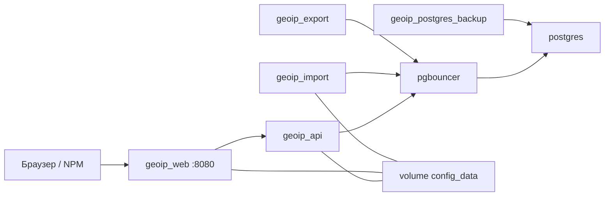

# Деплой GeoIP Analytics в Portainer (Stacks)

Пошаговая инструкция для развёртывания production-стека через **Portainer → Stacks**.  
Рассчитана на оператора без глубокого опыта Docker: каждый шаг — что нажать, что ввести и что должно получиться.

**Репозиторий:** [github.com/finenumbers/geoip](https://github.com/finenumbers/geoip)  
**Разработчик:** [Finenumbers](https://finenumbers.com) · apps@finenumbers.com

---

## Содержание

1. [Что вы получите после деплоя](#1-что-вы-получите-после-деплоя)
2. [Требования к серверу](#2-требования-к-серверу)
3. [Как устроен stack (кратко)](#3-как-устроен-stack-кратко)
4. [Подготовка: пароли и ключи](#4-подготовка-пароли-и-ключи)
5. [Создание Stack из GitHub (рекомендуется)](#5-создание-stack-из-github-рекомендуется)
6. [Альтернатива: репозиторий уже на сервере](#6-альтернатива-репозиторий-уже-на-сервере)
7. [Первый запуск приложения (Admin)](#7-первый-запуск-приложения-admin)
8. [Импорт датасета ГРЧЦ](#8-импорт-датасета-грчц)
9. [HTTPS через NGINX Proxy Manager (опционально)](#9-https-через-nginx-proxy-manager-опционально)
10. [Обновление stack после изменений в GitHub](#10-обновление-stack-после-изменений-в-github)
11. [Бэкапы и восстановление](#11-бэкапы-и-восстановление)
12. [Проверки «всё работает»](#12-проверки-всё-работает)
13. [Troubleshooting](#13-troubleshooting)
14. [Чеклист готовности к production](#14-чеклист-готовности-к-production)

---

## 1. Что вы получите после деплоя

| Результат | Описание |
|-----------|----------|
| Веб-интерфейс | React SPA на порту **8080** хоста (`geoip_web`) |
| API | Внутри Docker-сети, **не** торчит наружу в production |
| PostgreSQL | Внутри Docker-сети + volume `pg_data` |
| Import worker | Автоимпорт по cron (10:00 MSK) + ручной запуск из Admin |
| Export worker | CSV-экспорт из Admin |
| Автобэкап БД | Sidecar `geoip_postgres_backup` → volume `pg_backups` |

**Первый запуск:** база данных **пустая**. Это нормально. Dashboard покажет checklist, `/api/v1/ready` вернёт `not_ready`, пока вы не импортируете датасет ГРЧЦ.

**Файл `.env` на сервере не нужен.** Все переменные задаются в Portainer → Stack → **Environment variables**.

---

## 2. Требования к серверу

| Параметр | Минимум | Рекомендуется |
|----------|---------|---------------|
| RAM | 4 GB | **8 GB+** (import worker может занять до 4 GB) |
| CPU | 2 vCPU | 4 vCPU |
| Диск | 30 GB свободно | 50 GB+ (БД + CSV при import) |
| ОС | Linux с Docker Engine | Ubuntu 22.04/24.04, Debian 12 |
| Portainer | CE 2.19+ или BE | с поддержкой Compose **include** |
| Docker Compose | v2.20+ | идёт с Docker Engine |
| Сеть | исходящий HTTPS | для GitHub, ГРЧЦ, Let's Encrypt (NPM) |

Дополнительно:

- Учётная запись **личного кабинета ГРЧЦ GeoIP** (email + пароль) — у каждого пользователя свои creds.
- (Опционально) домен и **NGINX Proxy Manager** для HTTPS — см. [NGINX-PROXY-MANAGER.md](NGINX-PROXY-MANAGER.md).

---

## 3. Как устроен stack (кратко)

Portainer использует **один** compose-файл из поля **Compose path** и запускает `docker compose build` именно по нему. Переменная `COMPOSE_FILE` **не работает** в Portainer.

```
docker-compose.portainer.yml   ← единственный compose path для Portainer
    ├── ghcr.io/finenumbers/geoip-api     (api, import, export)
    ├── ghcr.io/finenumbers/geoip-web     (web)
    ├── postgres + pgbouncer + backup
    └── bind-mount: infra/pgbouncer/, scripts/backup-postgres.sh
```

**Compose path в Portainer:** `docker-compose.portainer.yml`

Файл **не содержит** секций `build:` — образы скачиваются из GHCR.



| Контейнер | Имя | Назначение |
|-----------|-----|------------|
| `postgres` | `geoip_postgres` | База данных |
| `pgbouncer` | `geoip_pgbouncer` | Пул соединений |
| `api` | `geoip_api` | HTTP API, migrations при старте |
| `import` | `geoip_import` | Import worker + cron |
| `export` | `geoip_export` | Export worker |
| `web` | `geoip_web` | Nginx + SPA (**единственный порт на хост: 8080**) |
| `postgres-backup` | `geoip_postgres_backup` | Периодический `pg_dump` |

| Volume | Что хранит |
|--------|------------|
| `pg_data` | Данные PostgreSQL |
| `config_data` | Admin-настройки, `secrets.enc`, `proxy.env` |
| `import_data` | Временные файлы import |
| `export_data` | Готовые CSV-экспорты |
| `pg_backups` | Автобэкапы Postgres |

> **Важно:** после обновления репозитория нажмите **Pull and redeploy** — иначе Portainer использует старый compose с `build:` и ошибкой `lstat .../packages`.

---

## 4. Подготовка: пароли и ключи

Перед созданием stack подготовьте значения. Сохраните их в менеджере паролей.

### 4.1. POSTGRES_PASSWORD

Сильный пароль для PostgreSQL, например 24+ символов.

```
Пример: K7m#pL9xQ2vN4wR8sT1yU5zA3bC6dE0f
```

> После смены пароля нужно синхронизировать PgBouncer — см. [раздел 13](#pgbouncer-auth-failed).

### 4.2. CONFIG_MASTER_KEY (рекомендуется для production)

64 hex-символа (32 байта). Шифрует `secrets.enc` в volume `config_data`.  
**Сгенерируйте один раз и сохраните backup** — без ключа secrets не расшифровать после redeploy.

На Linux/macOS:

```bash
openssl rand -hex 32
```

Пример вывода:

```
a1b2c3d4e5f6789012345678901234567890abcdef1234567890abcdef123456
```

### 4.3. Итоговый набор переменных

Скопируйте шаблон из [`infra/portainer/stack.env.example`](../infra/portainer/stack.env.example):

```env
POSTGRES_USER=geoip
POSTGRES_PASSWORD=ВАШ-СИЛЬНЫЙ-ПАРОЛЬ
POSTGRES_DB=geoip
CONFIG_MASTER_KEY=ваши-64-hex-символа-из-openssl
BACKUP_INTERVAL_SECONDS=86400
```

| Переменная | Обязательно | Описание |
|------------|-------------|----------|
| `POSTGRES_USER` | нет | default `geoip` |
| `POSTGRES_PASSWORD` | **да (prod)** | Пароль PostgreSQL |
| `POSTGRES_DB` | нет | default `geoip` |
| `CONFIG_MASTER_KEY` | **да (prod)** | 64 hex, шифрование secrets |
| `BACKUP_INTERVAL_SECONDS` | нет | Интервал автобэкапа (86400 = 24 ч) |
| `GEOIP_IMAGE_TAG` | нет | Тег GHCR-образов (default `latest`) |

Секреты ГРЧЦ, API keys, Google Maps, cron — **не** сюда. Они задаются позже в **Admin UI** (`/admin`).

---

## 5. Создание Stack из GitHub (рекомендуется)

Portainer клонирует репозиторий, **скачивает готовые образы** из GHCR и поднимает контейнеры. Локальная сборка (`docker compose build`) **не нужна**.

### Шаг 5.1. Открыть создание stack

1. Войдите в Portainer.
2. Выберите **Environment** (ваш Docker-хост).
3. Меню слева → **Stacks**.
4. Кнопка **+ Add stack**.

### Шаг 5.2. Имя stack

| Поле | Значение |
|------|----------|
| **Name** | `geoip` |

Имя можно своё, но дальше в инструкции используется `geoip`.

### Шаг 5.3. Build method → Repository

1. Выберите **Repository** (не Web editor).
2. Заполните поля:

| Поле | Значение |
|------|----------|
| **Repository URL** | `https://github.com/finenumbers/geoip` |
| **Repository reference** | `refs/heads/main` или `main` |
| **Compose path** | **`docker-compose.portainer.yml`** (обязательно — без bind mounts на `./infra/`) |
| **Authentication** | выключено (публичный репозиторий) |

Для **приватного форка** включите Authentication и укажите Personal Access Token GitHub (read repo).

### Шаг 5.4. Environment variables

Прокрутите до блока **Environment variables**.

**Способ A — загрузка из файла (если Portainer поддерживает):**  
загрузите подготовленный файл на основе `stack.env.example`.

**Способ B — вручную (универсально):**  
нажмите **Add an environment variable** для каждой строки:

| name | value |
|------|-------|
| `POSTGRES_USER` | `geoip` |
| `POSTGRES_PASSWORD` | ваш пароль из п. 4.1 |
| `POSTGRES_DB` | `geoip` |
| `CONFIG_MASTER_KEY` | ваш hex из п. 4.2 |
| `BACKUP_INTERVAL_SECONDS` | `86400` |
| `GEOIP_IMAGE_TAG` | `latest` |

> **Не добавляйте** `env_file: .env` — переменные задаются в Portainer → **Environment variables**.

> **Критично:** Compose path = **`docker-compose.portainer.yml`**. Если указать `docker-compose.yml`, Portainer запустит `compose build` и упадёт: `lstat .../packages: no such file or directory`. `COMPOSE_FILE` Portainer **не поддерживает**.

### Шаг 5.5. Deploy

1. Нажмите **Deploy the stack**.
2. Portainer начнёт:
   - `git clone` репозитория;
   - `docker compose pull` образов GHCR;
   - `docker compose up` всех сервисов.

**Первый деплой занимает 3–8 минут** (скачивание образов Postgres, API, Web).

### Шаг 5.6. Дождаться running

1. **Stacks → geoip** — статус stack.
2. **Containers** — все контейнеры должны стать **running**:

```
geoip_postgres          running
geoip_pgbouncer         running
geoip_api               running   ← может быть starting 1–2 мин (migrations)
geoip_import            running
geoip_export            running
geoip_web               running
geoip_postgres_backup   running
```

3. Если `geoip_api` долго **starting** — откройте **Logs**. Нормально увидеть migrations при первом старте. Healthcheck API в prod ждёт до **120 секунд** (`start_period`).

4. Если `geoip_web` **unhealthy**, пока `geoip_api` не healthy — подождите, web зависит от API.

### Шаг 5.7. Проверка с хоста

На сервере Docker (SSH):

```bash
curl -s http://127.0.0.1:8080/api/v1/health
# {"status":"ok","timestamp":"..."}

curl -s http://127.0.0.1:8080/api/v1/public/setup-checklist
# JSON с шагами onboarding

curl -s http://127.0.0.1:8080/api/v1/ready
# status: "not_ready" — ожидаемо до первого import
```

В браузере: `http://IP-ВАШЕГО-СЕРВЕРА:8080`

---

## 6. Альтернатива: репозиторий уже на сервере

Если GitHub недоступен из Portainer, но есть SSH на сервер:

```bash
sudo mkdir -p /opt/geoip
sudo git clone https://github.com/finenumbers/geoip.git /opt/geoip
cd /opt/geoip
```

Дальше в Portainer:

1. **Stacks → Add stack → Repository**
2. Если Portainer не видит локальный путь — используйте **свой Git mirror** (Gitea/GitLab на том же сервере) с тем же `Compose path`.

**Или через CLI на сервере** (без Portainer UI, но тот же stack):

```bash
cd /opt/geoip
export POSTGRES_PASSWORD='...'
export CONFIG_MASTER_KEY='...'
docker compose -f docker-compose.portainer.yml up -d
```

Stack появится в Portainer как externally managed / через Docker Compose plugin — контейнеры будут видны в **Containers**.

> Web editor с одним файлом `stack.compose.yml` **не подходит** — не хватает `docker-compose.yml`, `docker-compose.prod.yml` и исходников для `build`.

---

## 7. Первый запуск приложения (Admin)

### 7.1. Создание администратора

1. Откройте: `http://<IP-сервера>:8080/admin/setup`  
   (или `https://ваш-домен/admin/setup` после NPM)
2. Задайте **логин** и **пароль** локального admin.
3. Нажмите **Создать**.

После этого `/admin/setup` больше недоступен — вход через `/admin/login`.

### 7.2. Что происходит автоматически

При первом старте API:

- создаётся volume `config_data` с `settings.json`, `secrets.enc`;
- генерируются API keys;
- `geoip_web` читает `proxy.env` для проксирования `/api` с ключом.

Пересборка web после этого **не нужна**.

### 7.3. Dashboard checklist

На главной (`/`) и в **Admin → Обзор** отображаются шаги:

| # | Шаг | Статус |
|---|-----|--------|
| 1 | Admin создан | ✓ после setup |
| 2 | ГРЧЦ creds сохранены | Admin → ГРЧЦ / Import |
| 3 | Датасет импортирован | Admin → Обзор → Импорт |
| 4 | Google Maps (опц.) | Admin → Интеграции |

---

## 8. Импорт датасета ГРЧЦ

### 8.1. Настройка доступа к ГРЧЦ

1. **Admin → ГРЧЦ / Import**
2. Введите **email** и **password** личного кабинета GeoIP ГРЧЦ.
3. **Сохранить**
4. **Проверить ГРЧЦ** — должно быть успешно (зелёная проверка).

### 8.2. Запуск импорта

1. **Admin → Обзор**
2. **Импортировать датасет**
3. Следите за прогрессом на Dashboard (последние импорты).

Import worker (`geoip_import`) скачивает CSV, загружает в Postgres, пересоздаёт materialized views.  
На полном датасете это **десятки минут и более** — не прерывайте контейнер.

Логи в Portainer: **Containers → geoip_import → Logs**

### 8.3. Автоимпорт по расписанию

После первой успешной настройки creds cron запускает import **ежедневно в 10:00 MSK** (настраивается в Admin).

### 8.4. Готовность системы

```bash
curl -s http://127.0.0.1:8080/api/v1/ready | jq .
```

Ожидается `"status": "ready"` (или `"degraded"` если ASN mapping ещё догружается — browse уже работает).

> **Не запускайте** `seed:fixture` в production — только для dev/CI.

---

## 9. HTTPS через NGINX Proxy Manager (опционально)

Production stack публикует **только порт 8080**. HTTPS настраивается **перед** GeoIP через NPM:

1. Proxy Host → Forward to `http://<docker-host>:8080`
2. SSL → Let's Encrypt
3. Access List → ограничить `/admin` и UI

Полная инструкция: **[NGINX-PROXY-MANAGER.md](NGINX-PROXY-MANAGER.md)**

После NPM открывайте `https://geoip.example.com/admin/login`.

---

## 10. Обновление stack после изменений в GitHub

### Ручное обновление

1. **Portainer → Stacks → geoip**
2. **Pull and redeploy** (или **Update the stack** → **Re-pull image and redeploy** / **Rebuild**)
3. Дождитесь пересборки образов

Volumes **`config_data`**, **`pg_data`**, **`pg_backups`** сохраняются — настройки Admin и БД не теряются.

### Webhook (автообновление при push)

1. **Stacks → geoip → Webhook**
2. Скопируйте URL webhook
3. GitHub → Repository → **Settings → Webhooks → Add webhook**
4. Payload URL = webhook Portainer, event **Just the push event**

При push в `main` Portainer пересоберёт stack.

### Смена POSTGRES_PASSWORD

1. Обновите переменную в **Stack → Environment variables**
2. Обновите [`infra/pgbouncer/userlist.txt`](../infra/pgbouncer/userlist.txt) в репозитории:

   ```
   "geoip" "НОВЫЙ-ПАРОЛЬ"
   ```

   (формат `auth_type = plain` в PgBouncer)

3. Push в Git + redeploy stack **или** отредактируйте файл на хосте и redeploy

---

## 11. Бэкапы и восстановление

### Автоматические

Контейнер `geoip_postgres_backup` пишет дампы в volume **`pg_backups`**.

Посмотреть файлы (на хосте):

```bash
docker run --rm -v geoip_pg_backups:/backups alpine ls -la /backups
```

(имя volume может быть `geoip_pg_backups` или `<stack>_pg_backups` — проверьте в **Volumes**)

### Ручной бэкап

```bash
docker exec geoip_postgres pg_dump -U geoip geoip | gzip > geoip_manual_$(date +%Y%m%d).sql.gz
```

### Восстановление

Остановите stack, восстановите dump в `geoip_postgres`, запустите снова.  
Подробнее: [УСТАНОВКА.md](УСТАНОВКА.md#бэкап-и-восстановление).

---

## 12. Проверки «всё работает»

| Проверка | Команда / действие | Ожидание |
|----------|-------------------|----------|
| Liveness | `curl :8080/api/v1/health` | `status: ok` |
| Readiness | `curl :8080/api/v1/ready` | `ready` после import |
| Onboarding | `curl :8080/api/v1/public/setup-checklist` | все шаги `done` |
| UI | браузер `/` | Dashboard без ошибок |
| Browse | `/browse/city` | таблица с данными; **Экспорт CSV** — вся выборка по фильтрам (не только строки на экране) |
| Lookup | `/lookup` | lookup по IP |
| Admin | `/admin` | вход по паролю |
| Import logs | Portainer → geoip_import | без ERROR после import |

---

## 13. Troubleshooting

### Stack «Limited» — «created outside of Portainer», нельзя обновить

Если в списке Stacks у **geoip** в колонке **Control** написано **Limited** (подсказка: *This stack was created outside of Portainer*), Portainer **не может** нормально обновлять этот stack через Pull and redeploy / Editor. Так бывает, если контейнеры поднимали через SSH (`docker compose up`) или stack «подхватился» Portainer’ом автоматически.

**Что делать — пересоздать stack через Portainer (данные можно сохранить):**

#### Шаг 1. Остановить старые контainers (SSH на сервер или Portainer → Containers)

```bash
docker stop geoip_api geoip_web geoip_import geoip_export geoip_pgbouncer geoip_postgres geoip_postgres_backup 2>/dev/null || true
docker rm geoip_api geoip_web geoip_import geoip_export geoip_pgbouncer geoip_postgres geoip_postgres_backup 2>/dev/null || true
```

> Volumes (`pg_data`, `config_data` и т.д.) **не удаляются** — настройки Admin и БД сохранятся, если не удалять volumes вручную.

#### Шаг 2. Удалить запись stack в Portainer

**Stacks → geoip → Remove** (или иконка корзины).  
Если Remove недоступен — после шага 1 запись часто исчезает сама или удаляется без «remove volumes».

**Не ставьте галочку «remove volumes»**, если хотите сохранить БД и `config_data`.

#### Шаг 3. Создать stack заново (правильный способ)

**Stacks → + Add stack**

| Поле | Значение |
|------|----------|
| Name | `geoip` |
| Build method | **Repository** |
| Repository URL | `https://github.com/finenumbers/geoip` |
| Reference | `main` |
| **Compose path** | **`docker-compose.portainer.yml`** |
| Environment | см. [`stack.env.example`](../infra/portainer/stack.env.example) |

**Deploy the stack**

Статус Control должен стать **Total** (как у `n8n` / `nginx` на вашем скриншоте).

#### Шаг 4. Проверка

```bash
curl -s http://127.0.0.1:8080/api/v1/health
```

Откройте `http://<сервер>:8080/admin/login` (или `/admin/setup`, если admin ещё не создан).

**На будущее:** не запускайте `docker compose up` для geoip на этом хосте вручную — только через Portainer Stack, иначе снова будет **Limited**.

---

### `userlist.txt` mount error / `not a directory`

```
error mounting "/data/compose/.../infra/pgbouncer/userlist.txt" ... not a directory
```

**Причина:** Portainer не клонирует полное дерево git — только compose. Bind-mount `./infra/pgbouncer/userlist.txt` не находит файл; Docker создаёт **каталог** вместо файла.

**Решение:**

1. Compose path = **`docker-compose.portainer.yml`** (актуальный `main` — configs inline, без bind mounts)
2. **Pull and redeploy**
3. Не используйте `docker-compose.yml` в Portainer — в нём bind mounts на `./infra/` (для локального CLI с полным clone)

### `lstat .../packages: no such file or directory` (compose build failed)

**Типичная ошибка Portainer:**

```
Failed to deploy a stack: compose build operation failed:
resolve : lstat /data/compose/58/packages: no such file or directory
```

**Причина:** Portainer деплоит **старую версию** compose из кэша stack (до commit с GHCR images) — в ней был `build: context: .` с `packages/`. Либо не нажали **Pull and redeploy** после `git push`.

**Решение:**

1. **Stacks → geoip → Pull and redeploy** (обязательно — подтянуть последний `main`)
2. Compose path: `docker-compose.portainer.yml` или `docker-compose.yml` — оба без `build:` в актуальном репозитории
3. Удалите `COMPOSE_FILE` из env если есть
4. **Update the stack**

### Stack не деплоится / «compose file not found»

| Причина | Решение |
|---------|---------|
| Неверный Compose path | **`docker-compose.portainer.yml`** |
| Web editor без repo | Перейдите на **Repository** method |
| Старая версия Compose | Обновите Docker Engine / Portainer |

### «env file .env not found»

В актуальной версии репозитория **`env_file: .env` удалён** из compose.  
Обновите stack до последнего `main` и задайте переменные в Portainer → **Environment variables**.

### geoip_api exited (1) / unhealthy / restarting

Самая частая причина — **пароль Postgres со спецсимволами** (`#`, `@`, `:`, `/` и т.д.) в старом образе API.

**Симптом в Logs → geoip_api:**

```
Invalid bootstrap environment: { DATABASE_URL: [ 'Invalid url' ] }
```

Compose подставлял пароль в `DATABASE_URL` без URL-encoding; Zod отклонял такую строку и контейнер завершался с кодом **1** до migrations.

**Исправление (с коммита после `bootstrap-env` + `docker-compose.portainer.yml` на main):**

1. Обновите stack до последнего `main` (compose передаёт `POSTGRES_USER` / `POSTGRES_PASSWORD` / `POSTGRES_DB`, не сырой `DATABASE_URL`).
2. Дождитесь **Actions → Publish Docker images** (зелёный) — нужен новый `ghcr.io/finenumbers/geoip-api:latest`.
3. **Pull and redeploy** stack в Portainer.

**Другие причины exit (1):**

| Симптом в логах | Причина | Решение |
|-----------------|---------|---------|
| `password authentication failed` | `POSTGRES_PASSWORD` не совпадает с уже существующим volume `pg_data` | Удалите volume `pg_data` (потеря данных!) или верните старый пароль |
| `Failed to decrypt config secrets.enc` | `CONFIG_MASTER_KEY` не совпадает с volume `config_data` | Верните исходный ключ или удалите `config_data` для чистого старта |
| `Migration failed` | БД недоступна / pgbouncer не healthy | Проверьте `geoip_postgres`, `geoip_pgbouncer` |

1. **Logs → geoip_api** — первая строка ошибки решает, какая строка таблицы выше
2. Пароль в **`POSTGRES_PASSWORD`** должен совпадать с тем, что в pgbouncer userlist (Portainer compose генерирует его автоматически из env)
3. Первый старт — подождите до **2 минут** (migrations + `start_period: 120s`)

### PgBouncer auth failed

Пароль в **`POSTGRES_PASSWORD`** должен совпадать со второй колонкой в `infra/pgbouncer/userlist.txt`:

```
"geoip" "тот-же-пароль"
```

Redeploy stack после правки.

### Dashboard: API 401 / not_ready

| Симптом | Решение |
|---------|---------|
| `not_ready` | Нормально до import — см. checklist |
| 401 на `/api` | Проверьте volume `config_data`; перезапустите `geoip_web` после первого boot API |
| Admin 401 | Пройдите `/admin/setup` или проверьте NPM Access List |

### Import failed

1. Admin → **Проверить ГРЧЦ**
2. Logs → **geoip_import**
3. Admin → Dashboard → детали failed run

### Порт 8080 занят

Измените mapping в fork или остановите конфликтующий сервис. В production overlay опубликован только **8080**.

### Нехватка памяти при import

Увеличьте RAM хоста или лимит import worker в `docker-compose.prod.yml` (требует fork). Минимум **8 GB** RAM на сервер.

---

## 14. Чеклист готовности к production

- [ ] Stack `geoip` — все контейнеры **running**
- [ ] `POSTGRES_PASSWORD` — не default `geoip`
- [ ] `CONFIG_MASTER_KEY` — сохранён в backup
- [ ] Admin создан через `/admin/setup`
- [ ] ГРЧЦ creds проверены
- [ ] Import завершён успешно
- [ ] `/api/v1/ready` → `ready`
- [ ] (Опц.) NPM: HTTPS + Access List
- [ ] (Опц.) Google Maps key в Admin → Интеграции
- [ ] Volume `pg_backups` — автобэкап работает

---

## Связанные документы

| Документ | Когда читать |
|----------|--------------|
| [УСТАНОВКА.md](УСТАНОВКА.md) | CLI Compose, общие сведения |
| [NGINX-PROXY-MANAGER.md](NGINX-PROXY-MANAGER.md) | HTTPS и Access List |
| [ADMIN.md](ADMIN.md) | Разделы Admin UI |
| [FAQ.md](FAQ.md) | Частые вопросы |
| [БЕЗОПАСНОСТЬ.md](БЕЗОПАСНОСТЬ.md) | Секреты и perimeter |
| [АРХИТЕКТУРА.md](АРХИТЕКТУРА.md) | Архитектура системы |

---

**Finenumbers** · [finenumbers.com](https://finenumbers.com) · apps@finenumbers.com
