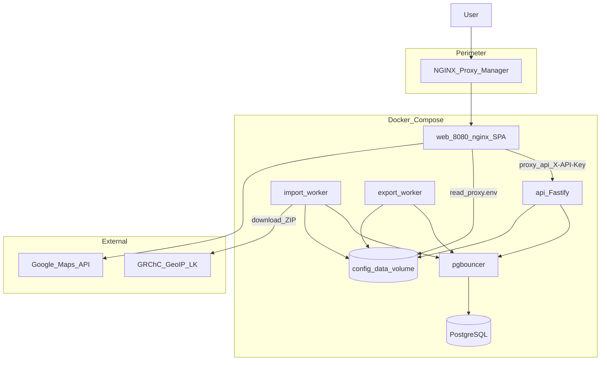

# Архитектура GeoIP Analytics

**Репозиторий:** [github.com/finenumbers/geoip](https://github.com/finenumbers/geoip)  
**Разработчик:** [Finenumbers](https://finenumbers.com) · apps@finenumbers.com

---

## Назначение

Production-grade веб-сервис для аналитики и поиска по официальным CSV-выгрузкам ГРЧЦ РФ (GeoIP) и публичным снимкам NRO RIR/IANA delegated. Оператор импортирует датасеты, строит аналитические представления в PostgreSQL и предоставляет UI для browse (ГРЧЦ и RIR), facet-поиска, IP lookup, экспорта CSV и сравнения расхождений **ГРЧЦ ≠ RIR CC**.

---

## Высокоуровневая схема



---

## Monorepo

| Пакет | Ответственность |
|-------|-----------------|
| `packages/shared` | Zod-схемы, API-контракты, table profiles, defaults |
| `packages/api` | Fastify HTTP, Drizzle, SQL-слой, import/export workers, config store |
| `packages/web` | React SPA, TanStack Router/Query/Table, nginx entrypoint |

---

## Compose services

| Сервис | Назначение |
|--------|------------|
| `postgres` | База данных |
| `pgbouncer` | Connection pooling (transaction mode) |
| `api` | HTTP API, migrations on startup, config watcher |
| `import` | Download → staging → swap → MV → caches → ASN mapping |
| `rir` | NRO delegated-extended (5 RIR + IANA) → `rir_delegations` |
| `export` | Async CSV export jobs |
| `web` | Nginx + SPA — единственная точка входа `:8080` |

Portainer: `docker-compose.portainer.yml` (inline configs, GHCR images).  
CLI: `docker-compose.yml` + `docker-compose.prod.yml`.

---

## Data plane

### Источник данных

- **City blocks** — сеть → город/регион
- **Country blocks** — сеть → страна
- **ASN blocks** — сеть → ASN/org

### Import pipeline

```
download ZIP (GRChC LK)
  → staging tables
  → validate
  → atomic swap (production tables)
  → production indexes
  → materialized views refresh
  → facet/filter caches
  → ASN block mapping
  → soft-fail: rebuild geo_rir_cc_mismatches (если RIR тоже ready)
```

Import worker: configurable daily cron (Admin → Общие, TZ = displayTimezone; default 10:00) + manual trigger (admin session).  
RIR worker после успешного swap делегаций аналогично вызывает soft-fail rebuild расхождений (если ГРЧЦ ready).

### Параллельный слой RIR (независим от ГРЧЦ)

Ежедневная загрузка `delegated-*-extended-latest` (RIPE/ARIN/APNIC/LACNIC/AFRINIC) + `delegated-iana-latest` в таблицы `rir_delegations` / `rir_dataset_state`.  
Cron: configurable (Admin → Общие; default 06:00 в displayTimezone).

**Browse UI:** `/browse/rir` (IP: locked `resource_type ∈ {ipv4,ipv6}`) и `/browse/rir-asn` (ASN: locked `asn`).  
**API:** `GET /api/v1/table/rir` (один endpoint; режим задаётся фильтрами).

Слой RIR **не** участвует в Lookup и **не** влияет на GeoIP `/ready`. В обычном Browse RIR строки **не джойнятся** с city/country MV. Поле `registry` — источник делегирования (в т.ч. `iana`). Семантика `cc` — legal country of holder, не геолокация ГРЧЦ.

История снимков RIR и «трансферы» в продукте отсутствуют (таблицы/UI удалены).

### Слой расхождений ГРЧЦ ≠ RIR CC

Отдельная материализация **только mismatches** между ISO country block ГРЧЦ и CC покрывающего RIR CIDR.

```
geo_country_blocks ⨝ geo_country_locations
  ⨝ LATERAL most-specific rir_delegations (ipv4|ipv6, network >>= block)
  LEFT JOIN geo_country_block_asn
→ INSERT только если upper(grchc_cc) IS DISTINCT FROM upper(rir_cc)
→ geo_rir_cc_mismatches
```

| Объект | Назначение |
|--------|------------|
| `geo_rir_cc_mismatches` | Строки расхождений (+ `asn` / `asn_org`, `range_text`, `registry`) |
| `geo_rir_cc_mismatch_state` | Singleton: `never` \| `running` \| `ready` \| `failed`, `row_count`, `rebuilt_at`, `duration_ms`, `last_error` |

**Job:** `rebuildGeoRirCcMismatches` (`packages/api/src/jobs/geo-rir-cc-mismatch-rebuild.ts`).

- **Readiness gate:** и ГРЧЦ (`mv_status=ready`, `country_row_count>0`), и RIR ready — иначе no-op без TRUNCATE.
- **Advisory lock** `0x43434d49` (`CCMI`) — сериализация с Admin wipe.
- **Триггеры:** успешный импорт ГРЧЦ; успешный импорт RIR; `ensureCcMismatchRebuildInBackground` при старте API (`never`/`failed`/stale `running` > 30 мин).
- **Failure:** `status=failed`, `row_count=0`, `duration_ms` заполнен; импорт при этом уже считается успешным.
- **UI/API:** `/cc-mismatch`, `GET /api/v1/table/cc-mismatch`, `/state`, `/facet`. CSV export для этого слоя нет.

### Хранение

| Слой | Объекты |
|------|---------|
| Production (ГРЧЦ) | `geo_city_blocks`, `geo_country_blocks`, `geo_asn_blocks`, locations |
| Analytics (ГРЧЦ) | `mv_city_blocks_analytics`, `mv_country_blocks_analytics`, `mv_city_blocks_ru` |
| RIR | `rir_delegations`, `rir_dataset_state`, `rir_rdap_cache` |
| CC mismatch | `geo_rir_cc_mismatches`, `geo_rir_cc_mismatch_state` |
| Caches | `facet_count_cache`, `filter_count_cache`, `block_asn_mapping` |

### Query paths

1. **Table API (ГРЧЦ)** — фильтры + sort + keyset/offset по MV / ASN
2. **Table API (RIR)** — browse `rir_delegations` (отдельная готовность)
3. **Table API (CC mismatch)** — browse материализованных расхождений
4. **Facet API** — `/table/metadata/facet` (Browse) и `/table/cc-mismatch/facet`
5. **Lookup API** — `POST /lookup` (ГРЧЦ LPM), `POST /rir/lookup` (RIR snapshot LPM), `POST /rir/enrich` (RDAP opt-in)

Профили полей (`table-profiles.ts`) разделяют city/country/rir/asn.

---

## Control plane

### Config store (`config_data`)

| Файл | Содержимое |
|------|------------|
| `settings.json` | Cron flags, лимиты, CORS, logging |
| `secrets.enc` | AES-GCM secrets |
| `proxy.env` | nginx → API key |
| `meta.json` | Version, timestamps |
| `.master-key` | Auto master key |

Hot-reload: config watcher на API перечитывает store. Некоторые поля требуют API restart или web reload — см. `pendingReload` в Admin.

Bootstrap env: `DATABASE_*`, `CONFIG_DATA_DIR`, `CONFIG_MASTER_KEY`.

---

## Readiness (`/api/v1/ready`)

| status | Условие |
|--------|---------|
| `not_ready` | Нет core: database, dataset, MV, indexes |
| `degraded` | Core OK; ASN mapping или import running |
| `ready` | Все checks true, import не running |

Кэш ready-response для снижения нагрузки на БД.

---

## Security model

| Слой | Механизм |
|------|----------|
| Perimeter | NPM HTTPS + Access List |
| Admin UI | Session cookie (HMAC), scrypt password, rate limit in-memory |
| Data API | `X-API-Key`, timing-safe compare |
| SQL | Parameterized queries + field allowlists |
| Secrets | Encrypted at rest, masked in admin API |
| Prod errors | Generic 500 без stack trace |

Подробнее: [РАЗРАБОТКА-И-БЕЗОПАСНОСТЬ.md](РАЗРАБОТКА-И-БЕЗОПАСНОСТЬ.md), [ПЕРИМЕТР-И-HTTPS.md](ПЕРИМЕТР-И-HTTPS.md).

---

## Backlog

См. [ROADMAP.md](ROADMAP.md) — distributed rate limit, import API key M2M, bundle size и др.

---

## См. также

- [РАЗВЁРТЫВАНИЕ.md](РАЗВЁРТЫВАНИЕ.md) — деплой
- [СПРАВОЧНИК-API.md](СПРАВОЧНИК-API.md) — HTTP API
- [АДМИНИСТРИРОВАНИЕ.md](АДМИНИСТРИРОВАНИЕ.md) — config store

**Finenumbers** · [finenumbers.com](https://finenumbers.com) · apps@finenumbers.com
