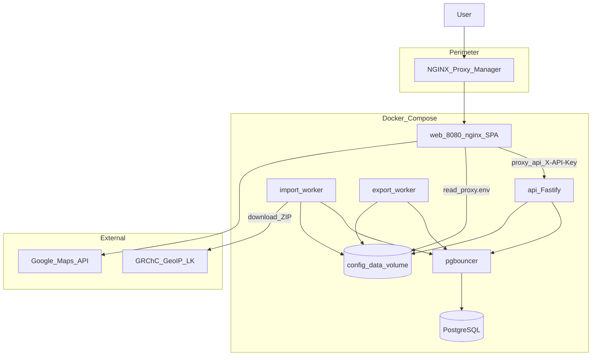

# Архитектура GeoIP Analytics

**Репозиторий:** [github.com/finenumbers/geoip](https://github.com/finenumbers/geoip)  
**Разработчик:** [Finenumbers](https://finenumbers.com) · apps@finenumbers.com

---

## Назначение

Production-grade веб-сервис для аналитики и поиска по официальным CSV-выгрузкам ГРЧЦ РФ (GeoIP). Оператор импортирует датасет, строит аналитические представления в PostgreSQL и предоставляет UI для browse, facet-поиска, IP lookup и экспорта.

---

## Высокоуровневая схема



---

## Monorepo

| Пакет | Ответственность |
|-------|-----------------|
| `packages/shared` | Zod-схемы, API-контракты, table profiles, defaults |
| `packages/api` | Fastify HTTP, Drizzle, SQL-слой, import/export workers, config store |
| `packages/web` | React SPA, TanStack Router/Query/Table, nginx entrypoint |

---

## Compose services

| Сервис | Назначение |
|--------|------------|
| `postgres` | База данных |
| `pgbouncer` | Connection pooling (transaction mode) |
| `api` | HTTP API, migrations on startup, config watcher |
| `import` | Download → staging → swap → MV → caches → ASN mapping |
| `export` | Async CSV export jobs |
| `web` | Nginx + SPA — единственная точка входа `:8080` |

Portainer: `docker-compose.portainer.yml` (inline configs, GHCR images).  
CLI: `docker-compose.yml` + `docker-compose.prod.yml`.

---

## Data plane

### Источник данных

- **City blocks** — сеть → город/регион
- **Country blocks** — сеть → страна
- **ASN blocks** — сеть → ASN/org

### Import pipeline

```
download ZIP (GRChC LK)
  → staging tables
  → validate
  → atomic swap (production tables)
  → production indexes
  → materialized views refresh
  → facet/filter caches
  → ASN block mapping
```

Import worker: cron **10:00 Europe/Moscow** + manual trigger (admin session).

### Хранение

| Слой | Объекты |
|------|---------|
| Production | `geo_city_blocks`, `geo_country_blocks`, `geo_asn_blocks`, locations |
| Analytics | `mv_city_blocks_analytics`, `mv_country_blocks_analytics`, `mv_city_blocks_ru` |
| Caches | `facet_count_cache`, `filter_count_cache`, `block_asn_mapping` |

### Query paths

1. **Table API** — фильтры + sort + keyset/offset pagination по MV
2. **Facet API** — значения для column filters (cache → live sample)
3. **Lookup API** — longest-prefix match по base tables (`network >>= ip`)

Профили полей (`table-profiles.ts`) разделяют city/country.

---

## Control plane

### Config store (`config_data`)

| Файл | Содержимое |
|------|------------|
| `settings.json` | Cron flags, лимиты, CORS, logging |
| `secrets.enc` | AES-GCM secrets |
| `proxy.env` | nginx → API key |
| `meta.json` | Version, timestamps |
| `.master-key` | Auto master key |

Hot-reload: config watcher на API перечитывает store. Некоторые поля требуют API restart или web reload — см. `pendingReload` в Admin.

Bootstrap env: `DATABASE_*`, `CONFIG_DATA_DIR`, `CONFIG_MASTER_KEY`.

---

## Readiness (`/api/v1/ready`)

| status | Условие |
|--------|---------|
| `not_ready` | Нет core: database, dataset, MV, indexes |
| `degraded` | Core OK; ASN mapping или import running |
| `ready` | Все checks true, import не running |

Кэш ready-response для снижения нагрузки на БД.

---

## Security model

| Слой | Механизм |
|------|----------|
| Perimeter | NPM HTTPS + Access List |
| Admin UI | Session cookie (HMAC), scrypt password, rate limit in-memory |
| Data API | `X-API-Key`, timing-safe compare |
| SQL | Parameterized queries + field allowlists |
| Secrets | Encrypted at rest, masked in admin API |
| Prod errors | Generic 500 без stack trace |

Подробнее: [РАЗРАБОТКА-И-БЕЗОПАСНОСТЬ.md](РАЗРАБОТКА-И-БЕЗОПАСНОСТЬ.md), [ПЕРИМЕТР-И-HTTPS.md](ПЕРИМЕТР-И-HTTPS.md).

---

## Backlog

См. [ROADMAP.md](ROADMAP.md) — distributed rate limit, import API key M2M, bundle size и др.

---

## См. также

- [РАЗВЁРТЫВАНИЕ.md](РАЗВЁРТЫВАНИЕ.md) — деплой
- [СПРАВОЧНИК-API.md](СПРАВОЧНИК-API.md) — HTTP API
- [АДМИНИСТРИРОВАНИЕ.md](АДМИНИСТРИРОВАНИЕ.md) — config store

**Finenumbers** · [finenumbers.com](https://finenumbers.com) · apps@finenumbers.com
