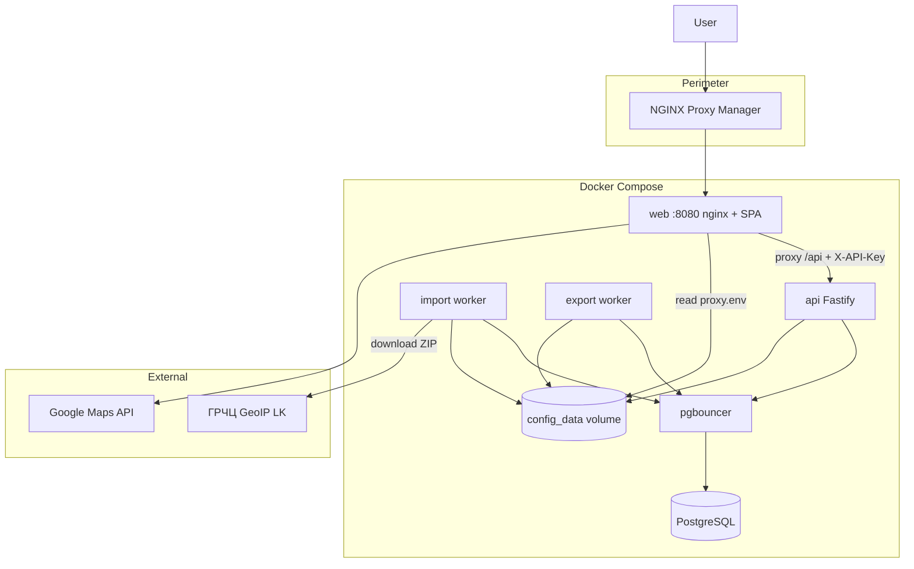

# Архитектура GeoIP Analytics

**Репозиторий:** [github.com/finenumbers/geoip](https://github.com/finenumbers/geoip)  
**Разработчик:** [Finenumbers](https://finenumbers.com) — оператор телефонной связи для бизнеса · apps@finenumbers.com

---

## Назначение

GeoIP Analytics — production-grade веб-сервис для аналитики и поиска по официальным CSV-выгрузкам ГРЧЦ РФ (GeoIP). Оператор импортирует датасет, строит аналитические представления в PostgreSQL и предоставляет UI для browse, facet-поиска, IP lookup и экспорта.

## Высокоуровневая схема

## Monorepo

| Пакет | Ответственность |
|-------|-----------------|
| `packages/shared` | Zod-схемы, API-контракты, table profiles, CSV schemas, defaults |
| `packages/api` | Fastify HTTP, Drizzle, SQL-слой, import/export workers, config store |
| `packages/web` | React SPA, TanStack Router/Query/Table, nginx entrypoint |

## Data plane

### Источник данных

- **City blocks** — сеть → город/регион (`subdivision_1_name`, `city_name`)
- **Country blocks** — сеть → страна (без региона в исходнике ГРЧЦ)
- **ASN blocks** — сеть → ASN/org

Импорт: staging → validate → atomic swap → indexes → MV refresh → facet/filter caches → ASN mapping.

### Хранение

| Слой | Таблицы / объекты |
|------|-------------------|
| Production | `geo_city_blocks`, `geo_country_blocks`, `geo_asn_blocks`, `geo_*_locations` |
| Analytics | `mv_city_blocks_analytics`, `mv_country_blocks_analytics`, `mv_city_blocks_ru` (partial) |
| Caches | `facet_count_cache`, `filter_count_cache`, `block_asn_mapping` |

### Browse / Search

1. **Table API** — фильтры + sort + keyset/offset pagination по MV
2. **Facet API** — значения для column filters (cache → live sample при ASN-контексте)
3. **Lookup API** — longest-prefix match по base tables (`network >>= ip`)

Профили полей (`table-profiles.ts`) разделяют city/country: country не поддерживает `city_name` и `subdivision_1_name`.

## Control plane

### Runtime config store (`config_data` volume)

| Файл | Содержимое |
|------|------------|
| `settings.json` | Публичные настройки (cron, лимиты, CORS, flags) |
| `secrets.enc` | AES-GCM: ГРЧЦ creds, API keys, admin hash, session secret, Maps key |
| `proxy.env` | API key для nginx → backend (auto) |
| `meta.json` | Версия, timestamps |

Bootstrap env (compose): только `DATABASE_*`, `CONFIG_DATA_DIR`, опционально `CONFIG_MASTER_KEY`.

### Workers

- **import** — poll queue, cron, pipeline (download → swap → MV → caches)
- **export** — async CSV export jobs

## Security model

| Слой | Механизм |
|------|----------|
| Perimeter | NPM HTTPS + Access List |
| Admin UI | Session cookie (HMAC), scrypt password |
| Data API | `X-API-Key` (production: always enabled) |
| SQL | Parameterized queries + field allowlists |
| Secrets | Encrypted at rest, masked in admin API |

## Production checklist (перед push)

1. `./scripts/check-public-ready.sh`
2. `pnpm lint && pnpm test`
3. `CONFIG_MASTER_KEY` задан в production
4. NPM Access List на `/admin`
5. Google Maps key с HTTP referrer restriction

## План доработок (backlog)

| Приоритет | Задача |
|-----------|--------|
| P1 | Batch ASN lookup в facet sampling (N+1) |
| P2 | Distributed rate limit для admin login |
| P2 | Lookup без блокировки на MV refresh |
| P3 | Parallel MV refresh где возможно |
| P3 | Network filter CIDR validation (422) |

См. также: [УСТАНОВКА.md](УСТАНОВКА.md) · [NGINX-PROXY-MANAGER.md](NGINX-PROXY-MANAGER.md) · [БЕЗОПАСНОСТЬ.md](БЕЗОПАСНОСТЬ.md)
