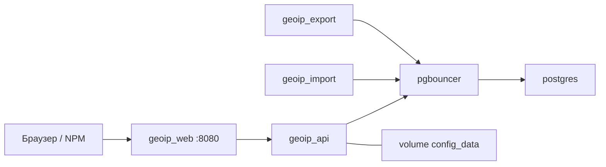

# Развёртывание

Руководство для оператора: Portainer, Docker Compose (CLI), volumes, backup и обновление.

**Репозиторий:** [github.com/finenumbers/geoip](https://github.com/finenumbers/geoip)  
**Разработчик:** [Finenumbers](https://finenumbers.com) · apps@finenumbers.com

После деплоя перейдите к [БЫСТРЫЙ-СТАРТ.md](БЫСТРЫЙ-СТАРТ.md).

---

## Содержание

1. [Требования](#требования)
2. [Состав stack](#состав-stack)
3. [Portainer (рекомендуется)](#portainer-рекомендуется)
4. [Docker Compose (CLI)](#docker-compose-cli)
5. [Локальная сборка образов](#локальная-сборка-образов)
6. [Volumes и config store](#volumes-и-config-store)
7. [Backup и восстановление](#backup-и-восстановление)
8. [Обновление](#обновление)
9. [Переопределение defaults](#переопределение-defaults)
10. [Остановка и удаление](#остановка-и-удаление)

---

## Требования

| Параметр | Минимум | Рекомендуется |
|----------|---------|---------------|
| RAM | 4 GB | **8 GB+** (import worker до ~4 GB) |
| CPU | 2 vCPU | 4 vCPU |
| Диск | 30 GB | 50 GB+ |
| ОС | Linux + Docker Engine | Ubuntu 22.04/24.04, Debian 12 |
| Portainer | CE 2.19+ | с поддержкой Compose |
| Docker Compose | v2.20+ | — |
| Сеть | исходящий HTTPS | GitHub, ГРЧЦ, Let's Encrypt (NPM) |

Дополнительно:

- Учётная запись **личного кабинета ГРЧЦ GeoIP**
- (Опционально) домен и **NGINX Proxy Manager** — [ПЕРИМЕТР-И-HTTPS.md](ПЕРИМЕТР-И-HTTPS.md)

Файл `.env` на сервере **не обязателен**. `POSTGRES_*` и теги образов заданы в compose.

---

## Состав stack

| Сервис | Контейнер | Назначение |
|--------|-----------|------------|
| `postgres` | `geoip_postgres` | База данных |
| `pgbouncer` | `geoip_pgbouncer` | Connection pooling |
| `api` | `geoip_api` | HTTP API, migrations при старте |
| `import` | `geoip_import` | Import worker + cron (Admin → Общие) |
| `export` | `geoip_export` | Async CSV export |
| `web` | `geoip_web` | Nginx + SPA — **единственный порт на хост: 8080** |



| Volume | Назначение |
|--------|------------|
| `pg_data` | Данные PostgreSQL |
| `config_data` | Admin-настройки, `secrets.enc`, `proxy.env` |
| `import_data` | Временные файлы import |
| `export_data` | Готовые CSV-экспорты |

**Первый запуск:** база **пустая** — `/api/v1/ready` = `not_ready` до успешного import. Это нормально.

---

## Portainer (рекомендуется)

Portainer использует **один** compose-файл из поля **Compose path**. Переменная `COMPOSE_FILE` **не работает**.

### Compose path (обязательно)

```
docker-compose.portainer.yml
```

Файл **без** `build:` — образы скачиваются из GHCR. **Не** используйте `docker-compose.yml` в Portainer — там bind mounts на `./infra/` и `build`, Portainer не клонирует полное дерево git.

### Создание stack из GitHub

1. **Portainer → Stacks → + Add stack**
2. **Build method:** Repository

| Поле | Значение |
|------|----------|
| **Name** | `geoip` |
| **Repository URL** | `https://github.com/finenumbers/geoip` |
| **Reference** | `main` |
| **Compose path** | **`docker-compose.portainer.yml`** |

3. **Environment variables** (опционально): `CONFIG_MASTER_KEY` — см. [ниже](#config_master_key)
4. **Deploy the stack**

Первый деплой: 3–8 минут (скачивание образов). Дождитесь **running** всех контейнеров. `geoip_api` может быть `starting` 1–2 мин (migrations).

### Проверка

```bash
curl -s http://127.0.0.1:8080/api/v1/health
curl -s http://127.0.0.1:8080/api/v1/public/setup-checklist
```

Браузер: `http://<IP-сервера>:8080/admin/setup`

### Environment variables (Portainer)

Шаблон: [`infra/portainer/stack.env.example`](../infra/portainer/stack.env.example)

| Переменная | Обязательно | Описание |
|------------|-------------|----------|
| `CONFIG_MASTER_KEY` | нет | 64 hex; шифрование `secrets.enc`. Пусто = auto-gen в volume |

**Не добавляйте** `POSTGRES_*`, `GEOIP_LK_*`, API keys — они задаются в **Admin UI**.

### Обновление stack

1. **Portainer → Stacks → geoip → Pull and redeploy**
2. Volumes `config_data` и `pg_data` сохраняются

**Webhook (опционально):** Stacks → geoip → Webhook → URL в GitHub → push event.

### Stack «Limited» (created outside of Portainer)

Если Control = **Limited**, Pull and redeploy не работает (stack поднят через SSH `docker compose up`).

**Пересоздать stack через Portainer (данные сохраняются):**

1. Остановить контейнеры (не удалять volumes):

```bash
docker stop geoip_api geoip_web geoip_import geoip_export geoip_pgbouncer geoip_postgres 2>/dev/null || true
docker rm geoip_api geoip_web geoip_import geoip_export geoip_pgbouncer geoip_postgres 2>/dev/null || true
```

2. **Stacks → geoip → Remove** — **без** «remove volumes»
3. Создать stack заново (Repository, compose path `docker-compose.portainer.yml`)
4. Control должен стать **Total**

**На будущее:** не запускайте `docker compose up` для geoip вручную на этом хосте — только через Portainer.

### Альтернатива: CLI на сервере

```bash
git clone https://github.com/finenumbers/geoip.git /opt/geoip
cd /opt/geoip
docker compose -f docker-compose.portainer.yml up -d
```

Контейнеры видны в Portainer, но stack может быть **Limited**.

Краткий чеклист: [`infra/portainer/README.md`](../infra/portainer/README.md)

---

## Docker Compose (CLI)

### Клонировать и запустить (GHCR images)

```bash
git clone https://github.com/finenumbers/geoip.git
cd geoip
docker compose -f docker-compose.yml -f docker-compose.prod.yml pull
docker compose -f docker-compose.yml -f docker-compose.prod.yml up -d
```

### Проверка

```bash
docker compose ps
curl -s http://localhost:8080/api/v1/health
```

Откройте `http://<хост>:8080/admin/setup` → [БЫСТРЫЙ-СТАРТ.md](БЫСТРЫЙ-СТАРТ.md)

---

## Локальная сборка образов

Нужен полный git clone:

```bash
docker compose -f docker-compose.yml -f docker-compose.prod.yml -f docker-compose.build.yml build
docker compose -f docker-compose.yml -f docker-compose.prod.yml -f docker-compose.build.yml up -d
```

При обновлении: `build` вместо `pull`.

---

## Volumes и config store

Volume `config_data` (`/data/geoip/config/` в контейнере):

| Файл | Содержимое |
|------|------------|
| `settings.json` | Публичные настройки (лимиты, CORS, flags) |
| `secrets.enc` | AES-256-GCM: ГРЧЦ, API keys, admin hash, Maps key |
| `proxy.env` | API key для nginx → backend (обновляется при save External key) |
| `meta.json` | Версия, timestamps |
| `.master-key` | Auto-generated master key (если `CONFIG_MASTER_KEY` не задан) |

Bootstrap env (compose): `DATABASE_*`, `CONFIG_DATA_DIR`, опционально `CONFIG_MASTER_KEY`.

Операционные секреты (ГРЧЦ, API keys, Google Maps) — только через **Admin UI**.

---

## Backup и восстановление

### CONFIG_MASTER_KEY

64 hex-символа. Шифрует `secrets.enc`.

| Вариант | Поведение |
|---------|-----------|
| Не задан | API автогенерирует ключ → `.master-key` в volume |
| Задан в Portainer / `.env` | Используется ваш ключ — **сохраните в backup** |

```bash
openssl rand -hex 32
```

### Backup volume `config_data`

**Сохраните отдельно:** значение `CONFIG_MASTER_KEY` (если задавали). Без master key и без `.master-key` в архиве `secrets.enc` не расшифровать.

```bash
mkdir -p backups
docker run --rm \
  -v geoip_config_data:/data:ro \
  -v "$(pwd)/backups:/backup" \
  alpine tar czf "/backup/config_data-$(date +%Y%m%d).tar.gz" -C /data .
```

Имя volume проверьте: `docker volume ls`.

### Восстановление config_data

```bash
docker compose -f docker-compose.yml -f docker-compose.prod.yml down
docker run --rm \
  -v geoip_config_data:/data \
  -v "$(pwd)/backups:/backup:ro" \
  alpine sh -c 'cd /data && tar xzf /backup/config_data-YYYYMMDD.tar.gz'
docker compose -f docker-compose.yml -f docker-compose.prod.yml up -d
```

Запустите stack с **тем же** `CONFIG_MASTER_KEY`.

### PostgreSQL

Автобэкап **не используется**. При потере данных — **повторный import** из ГРЧЦ (Admin → Обзор).

---

## Обновление

### CLI

```bash
cd geoip
git pull
docker compose -f docker-compose.yml -f docker-compose.prod.yml pull
docker compose -f docker-compose.yml -f docker-compose.prod.yml up -d
```

### Portainer

**Pull and redeploy** — volumes сохраняются.

### Смена POSTGRES_PASSWORD

Пароль в **`docker-compose.portainer.yml`** (или `docker-compose.yml`): секции `postgres`, `x-api-database-env`, config `pgbouncer_userlist`.

> Если volume `pg_data` уже создан со старым паролем — смена только в compose не поможет без миграции или пересоздания volume.

---

## Переопределение defaults

| Параметр | Где | Зачем |
|----------|-----|-------|
| `POSTGRES_*` | правка compose + pgbouncer userlist | Сильный пароль БД |
| `CONFIG_MASTER_KEY` | Portainer env или `.env` | Стабильное шифрование secrets |
| Image tag | замена `:latest` в compose | Pin версии GHCR |

Defaults в Portainer compose:

| Параметр | Значение |
|----------|----------|
| `POSTGRES_USER` / `PASSWORD` / `DB` | `geoip` / `geoip` / `geoip` |
| Образы | `ghcr.io/finenumbers/geoip-*:latest` |

---

## Остановка и удаление

Сервисы в compose имеют `restart: unless-stopped`: после падения процесса Docker поднимет контейнер снова. Явный **Stop** в Portainer / `docker compose down` / `docker stop` контейнеры **не** перезапускает — нужен Start / `up -d`.

```bash
# Остановить без удаления данных
docker compose -f docker-compose.yml -f docker-compose.prod.yml down

# Удалить контейнеры И volumes (БД и config будут потеряны!)
docker compose -f docker-compose.yml -f docker-compose.prod.yml down -v
```

---

## См. также

- [БЫСТРЫЙ-СТАРТ.md](БЫСТРЫЙ-СТАРТ.md) — onboarding после деплоя
- [ПЕРИМЕТР-И-HTTPS.md](ПЕРИМЕТР-И-HTTPS.md) — NPM и HTTPS
- [АДМИНИСТРИРОВАНИЕ.md](АДМИНИСТРИРОВАНИЕ.md) — Admin UI
- [РАЗРАБОТКА-И-БЕЗОПАСНОСТЬ.md](РАЗРАБОТКА-И-БЕЗОПАСНОСТЬ.md) — troubleshooting

**Finenumbers** · [finenumbers.com](https://finenumbers.com) · apps@finenumbers.com
